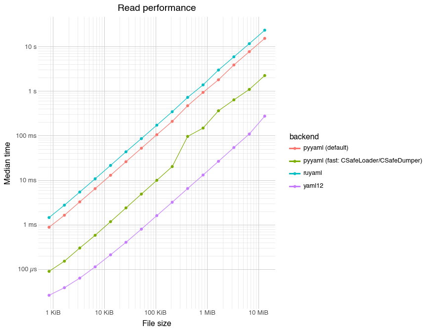
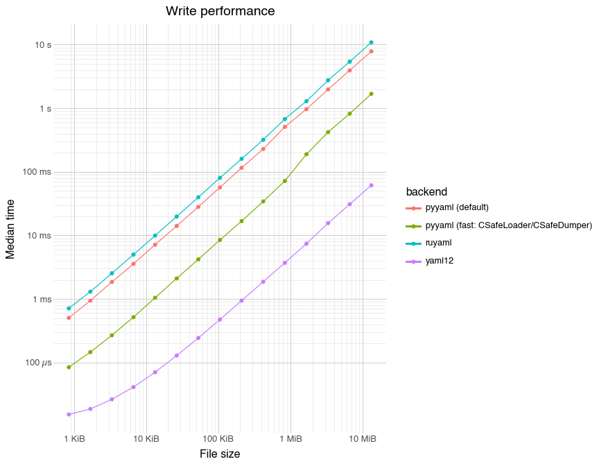

# Benchmarks and Performance


## Goal

Compare `yaml12` performance against:

- `PyYAML` (defaults)
- `PyYAML` (as fast as possible)
- `ruyaml`

We intentionally avoid testing semantic differences between YAML 1.1 and
1.2, as well as less-used YAML features like tags and streams. Instead,
we focus on the simple default usage of each library.

Operations:

- **read**: YAML file → Python object
- **write**: Python object → YAML file

## Reproduce

From the repo root:

``` bash
make venv
.venv/bin/python -m pip install py-yaml12 pyyaml ruyaml plotnine pandas jupyter ipykernel great-tables css-inline
QUARTO_PYTHON="$PWD/.venv/bin/python3" quarto render benchmarks.qmd
```

## Setup

Tweak these constants for faster iterations.

``` python
max_power = 15
max_time_s = 1
max_iters = 20_000
```

``` python
from __future__ import annotations

from dataclasses import dataclass
import math
import os
import tempfile
import time
from pathlib import Path
from statistics import median
from typing import Any, Callable, Literal

import pandas as pd
import ruyaml
import yaml
import yaml12
from great_tables import GT, loc, style
from IPython.display import HTML, display
from plotnine import (
    aes,
    element_line,
    geom_line,
    geom_point,
    ggplot,
    labs,
    scale_x_log10,
    scale_y_log10,
    theme,
    theme_minimal,
)
```

``` python
def fmt_bytes(n: float) -> str:
    units = ["B", "KiB", "MiB", "GiB", "TiB"]
    n = float(n)
    for unit in units:
        if abs(n) < 1024 or unit == units[-1]:
            if unit == "B":
                return f"{n:.0f} {unit}"
            s = f"{n:.1f}".rstrip("0").rstrip(".")
            return f"{s} {unit}"
        n /= 1024
    return f"{n:.1f} {units[-1]}"


def round_sig(x: float, sig: int = 1) -> float:
    if x == 0:
        return 0.0
    return round(x, sig - 1 - int(math.floor(math.log10(abs(x)))))


def fmt_bytes_rounded(n: float) -> str:
    units = ["B", "KiB", "MiB", "GiB", "TiB"]
    n = float(n)
    for idx, unit in enumerate(units):
        if abs(n) < 1024 or unit == units[-1]:
            if unit == "B":
                return f"{n:.0f} {unit}"
            rounded = round_sig(n, 1)
            if rounded >= 1000 and idx + 1 < len(units):
                n = n / 1024
                unit = units[idx + 1]
                rounded = round_sig(n, 1)
            return f"{rounded:.0f} {unit}"
        n /= 1024
    return f"{n:.1f} {units[-1]}"


def fmt_time_s(sec: float) -> str:
    sec = float(sec)
    if sec < 1e-6:
        return f"{sec * 1e9:.0f} ns"
    if sec < 1e-3:
        return f"{sec * 1e6:.1f}".rstrip("0").rstrip(".") + " µs"
    if sec < 1.0:
        return f"{sec * 1e3:.1f}".rstrip("0").rstrip(".") + " ms"
    return f"{sec:.2f}".rstrip("0").rstrip(".") + " s"


SIZE_TARGETS = tuple(10**power for power in range(4, 8))


def nearest_sizes(
    sizes: list[int],
    targets: tuple[int, ...] = SIZE_TARGETS,
) -> list[tuple[int, int]]:
    sizes = sorted(set(sizes))
    picked: list[tuple[int, int]] = []
    used: set[int] = set()
    for target in targets:
        size = min(sizes, key=lambda s: abs(s - target))
        if size in used:
            continue
        used.add(size)
        picked.append((size, target))
    return picked


@dataclass(frozen=True)
class BenchResult:
    samples_s: list[float]
    calls: int
    elapsed_s: float


def bench_case(
    fn,
    *,
    budget_s: float,
    max_iters: int,
) -> BenchResult:
    samples: list[float] = []
    calls = 0
    start = time.perf_counter()
    while calls < max_iters:
        t0 = time.perf_counter()
        fn()
        t1 = time.perf_counter()
        samples.append(t1 - t0)
        calls += 1
        if (t1 - start) >= budget_s:
            break

    return BenchResult(samples_s=samples, calls=calls, elapsed_s=time.perf_counter() - start)


@dataclass(frozen=True)
class Backend:
    name: str
    read: Callable[[str], Any]
    write: Callable[[Any], Any]


def bench_op(
    op: Literal["read", "write"],
    *,
    docs: list[dict],
    backends: list[Backend],
    budget_s: float,
    max_iters: int,
) -> pd.DataFrame:
    summary_rows: list[dict] = []

    for doc in docs:
        arg = doc["path"] if op == "read" else doc["obj"]
        for backend in backends:
            fn = backend.read if op == "read" else backend.write
            result = bench_case(
                lambda a=arg, f=fn: f(a),
                budget_s=budget_s,
                max_iters=max_iters,
            )
            summary_rows.append(
                {
                    "op": op,
                    "backend": backend.name,
                    "n_nodes": doc["n_nodes"],
                    "file_size": doc["file_size"],
                    "median_s": median(result.samples_s) if result.samples_s else float("nan"),
                    "n_samples": len(result.samples_s),
                    "calls": result.calls,
                    "elapsed_s": result.elapsed_s,
                }
            )

    return pd.DataFrame(summary_rows).sort_values(["file_size", "backend"])


def ratio_table_df(
    summary: pd.DataFrame,
    backend_order: list[str],
) -> tuple[pd.DataFrame, list[str]]:
    pivot = (
        summary.pivot(index="backend", columns="file_size", values="median_s")
        .reindex(backend_order)
    )
    picked = nearest_sizes(list(pivot.columns))
    size_cols = [size for size, _ in picked]
    labels = [fmt_bytes_rounded(target) for _, target in picked]

    ratio = pivot[size_cols].div(pivot.loc["yaml12", size_cols], axis=1)
    ratio.columns = labels
    out = ratio.reset_index().rename(columns={"backend": "Backend"})
    return out, labels


def plot_perf(
    summary: pd.DataFrame,
    *,
    title: str,
) -> None:
    size_min = float(summary["file_size"].min())
    size_max = float(summary["file_size"].max())
    exp_min = max(0, int(math.floor(math.log(size_min, 1024))))
    exp_max = max(exp_min, int(math.ceil(math.log(size_max, 1024))))
    candidates = [
        (1024**power) * mult
        for power in range(exp_min, exp_max + 1)
        for mult in (1, 10, 100)
    ]
    forced_break = 10 * 1024**2
    size_limit_max = max(size_max, forced_break)
    if forced_break not in candidates:
        candidates.append(forced_break)
    breaks = [value for value in candidates if size_min <= value <= size_limit_max]
    minor_candidates = [
        (1024**power) * mult * minor
        for power in range(exp_min, exp_max + 1)
        for mult in (1, 10, 100)
        for minor in range(2, 10)
    ]
    minor_breaks = sorted(
        {
            value
            for value in minor_candidates
            if size_min <= value <= size_limit_max
        }
        - set(breaks)
    )
    time_breaks = [1e-4, 1e-3, 1e-2, 1e-1, 1.0, 10.0]
    time_minor_breaks = sorted(
        {
            (10**power) * mult
            for power in range(-4, 2)
            for mult in range(2, 10)
            if 1e-4 <= (10**power) * mult <= 10.0
        }
        - set(time_breaks)
    )

    p = (
        ggplot(summary, aes(x="file_size", y="median_s", color="backend"))
        + geom_point()
        + geom_line()
        + labs(title=title, x="File size", y="Median time")
        + scale_x_log10(
            breaks=breaks,
            limits=(size_min, size_limit_max),
            minor_breaks=minor_breaks,
            labels=lambda xs: [fmt_bytes(x) for x in xs],
        )
        + scale_y_log10(
            breaks=time_breaks,
            minor_breaks=time_minor_breaks,
            labels=lambda ys: [fmt_time_s(y) for y in ys],
        )
        + theme_minimal(base_size=12)
        + theme(
            panel_grid_major=element_line(color="#c4c4c4", size=0.6),
            panel_grid_minor=element_line(color="#dddddd", size=0.4),
        )
    )
    display(p)


def render_ratio_table(
    summary: pd.DataFrame,
    *,
    title: str,
    subtitle: str,
    backend_order: list[str],
) -> None:
    table_df, vs_cols = ratio_table_df(summary, backend_order)
    col_widths = {col: "90px" for col in vs_cols}
    table = (
        GT(table_df, rowname_col="Backend")
        .tab_header(title=title, subtitle=subtitle)
        .tab_options(
            table_width="100%",
            table_layout="fixed",
            container_overflow_x="auto",
            table_font_size="12px",
            data_row_padding="4px",
            column_labels_background_color="#f5f6fa",
            column_labels_font_weight="600",
            row_striping_background_color="#f7f7f7",
            row_striping_include_stub=True,
            row_striping_include_table_body=True,
            quarto_disable_processing=True,
        )
        .cols_width(col_widths)
        .cols_align(align="right", columns=vs_cols)
        .tab_spanner(label="File size", columns=vs_cols)
        .fmt_number(
            columns=vs_cols,
            decimals=1,
            drop_trailing_zeros=True,
            drop_trailing_dec_mark=True,
            pattern="{x}x",
        )
        .tab_style(
            style=[style.fill("#eef2ff"), style.text(weight="bold")],
            locations=loc.body(rows=["yaml12"]),
        )
    )
    display(HTML(table.as_raw_html(inline_css=True)))


def run_section(
    op: Literal["read", "write"],
    *,
    title: str,
) -> pd.DataFrame:
    summary = bench_op(
        op,
        docs=docs,
        backends=backends,
        budget_s=max_time_s,
        max_iters=max_iters,
    )
    plot_perf(summary, title=f"{title} performance")
    render_ratio_table(
        summary,
        title=f"{title} summary",
        subtitle="Relative time vs yaml12",
        backend_order=backend_order,
    )
    return summary
```

## Generate inputs

To benchmark, we create YAML files consisting of a repeating sequence of
a small, fixed “mixed” node, repeated `2^(1:max_power)` times. This node
is designed to exercise the YAML 1.2 core schema (every core type is
represented). We generate these files with `yaml12.write_yaml()`.

``` python
def make_mixed_node() -> dict:
    return {
        "str": [
            "Lorem ipsum dolor sit amet, vel accumsan vitae faucibus ultrices leo",
            "neque? Et cursus lacinia, ut, sit donec facilisi eu interdum. Dui",
            "ipsum, vitae ligula commodo convallis ac sed nunc. Ipsum at nec lacus",
            "eros suscipit vitae.",
        ],
        "block_str": "lorem \n ipsum \n dolor\n",
        "bools": [True, False],
        "ints": [123, -123],
        "floats": [123.456, -123.456],
        "null": None,
    }


max_power = int(max_power)
max_iters = int(max_iters)
```

``` python
tmp_ctx = tempfile.TemporaryDirectory(prefix="yaml12-bench-")
tmp_dir = Path(tmp_ctx.name)

def make_yaml_doc(n_nodes: int) -> dict:
    path = tmp_dir / f"mixed_{n_nodes}.yaml"
    obj = [make_mixed_node() for _ in range(n_nodes)]
    yaml12.write_yaml(obj, path)
    return {
        "n_nodes": n_nodes,
        "path": str(path),
        "file_size": path.stat().st_size,
        "obj": obj,
    }


docs = [make_yaml_doc(2**p) for p in range(1, max_power + 1)]
```

## Backends

``` python
## read
def _yaml12_read(path: str):
    return yaml12.read_yaml(path)

def _pyyaml_default_read(path: str):
    with open(path, encoding="utf-8") as f:
        return yaml.safe_load(f)

def _pyyaml_fast_read(path: str):
    with open(path, encoding="utf-8") as f:
        return yaml.load(f, Loader=yaml.CSafeLoader)

ruyaml_loader_emitter = ruyaml.YAML(typ="safe")
def _ruyaml_read(path: str):
    with open(path, encoding="utf-8") as f:
        return ruyaml_loader_emitter.load(f)


## write
def _yaml12_write(obj):
    return yaml12.write_yaml(obj, os.devnull)

def _pyyaml_default_write(obj):
    with open(os.devnull, "w", encoding="utf-8") as f:
        return yaml.safe_dump(obj, f)

def _pyyaml_fast_write(obj):
    with open(os.devnull, "w", encoding="utf-8") as f:
        return yaml.dump(obj, f, Dumper=yaml.CSafeDumper, sort_keys=False)

def _ruyaml_write(obj):
    with open(os.devnull, "w", encoding="utf-8") as f:
        return ruyaml_loader_emitter.dump(obj, f)


backends = [
    Backend(
        name="yaml12",
        read=_yaml12_read,
        write=_yaml12_write,
    ),
    Backend(
        name="pyyaml (default)",
        read=_pyyaml_default_read,
        write=_pyyaml_default_write,
    ),
    Backend(
        name="pyyaml (fast: CSafeLoader/CSafeDumper)",
        read=_pyyaml_fast_read,
        write=_pyyaml_fast_write,
    ),
    Backend(
        name="ruyaml",
        read=_ruyaml_read,
        write=_ruyaml_write,
    ),
]
backend_order = [backend.name for backend in backends]
```

## Read performance

``` python
read_summary = run_section("read", title="Read")
```



<div id="xobpeqklxh" style="padding-left:0px;padding-right:0px;padding-top:10px;padding-bottom:10px;overflow-x:auto;overflow-y:auto;width:auto;height:auto;">
&#10;<table class="gt_table" style="font-family: -apple-system, BlinkMacSystemFont, 'Segoe UI', Roboto, Oxygen, Ubuntu, Cantarell, 'Helvetica Neue', 'Fira Sans', 'Droid Sans', Arial, sans-serif;-webkit-font-smoothing: antialiased;-moz-osx-font-smoothing: grayscale;display: table;border-collapse: collapse;line-height: normal;margin-left: auto;margin-right: auto;color: #333333;font-size: 12px;font-weight: normal;font-style: normal;background-color: #FFFFFF;border-top-style: solid;border-top-width: 2px;border-top-color: #A8A8A8;border-right-style: none;border-right-width: 2px;border-right-color: #D3D3D3;border-bottom-style: solid;border-bottom-width: 2px;border-bottom-color: #A8A8A8;border-left-style: none;border-left-width: 2px;border-left-color: #D3D3D3;table-layout: fixed;width: 100%" data-quarto-bootstrap="false" data-quarto-disable-processing="true">
<colgroup>
  <col>
  <col style="width:90px;">
  <col style="width:90px;">
  <col style="width:90px;">
  <col style="width:90px;">
</colgroup>
&#10;<thead style="border-style: none;">
&#10;  <tr class="gt_heading" style="border-style: none;background-color: #FFFFFF;text-align: center;border-bottom-color: #FFFFFF;border-left-style: none;border-left-width: 1px;border-left-color: #D3D3D3;border-right-style: none;border-right-width: 1px;border-right-color: #D3D3D3;">
    <td class="gt_heading gt_title gt_font_normal" colspan="5" style="border-style: none;color: #333333;font-size: 125%;font-weight: normal;padding-top: 4px;padding-bottom: 4px;padding-left: 5px;padding-right: 5px;border-bottom-color: #FFFFFF;border-bottom-width: 0;background-color: #FFFFFF;text-align: center;border-left-style: none;border-left-width: 1px;border-left-color: #D3D3D3;border-right-style: none;border-right-width: 1px;border-right-color: #D3D3D3;">Read summary</td>
  </tr>
  <tr class="gt_heading" style="border-style: none;background-color: #FFFFFF;text-align: center;border-bottom-color: #FFFFFF;border-left-style: none;border-left-width: 1px;border-left-color: #D3D3D3;border-right-style: none;border-right-width: 1px;border-right-color: #D3D3D3;">
    <td class="gt_heading gt_subtitle gt_font_normal gt_bottom_border" colspan="5" style="border-style: none;color: #333333;font-size: 85%;font-weight: normal;padding-top: 3px;padding-bottom: 5px;padding-left: 5px;padding-right: 5px;border-top-color: #FFFFFF;border-top-width: 0;background-color: #FFFFFF;text-align: center;border-bottom-color: #D3D3D3;border-left-style: none;border-left-width: 1px;border-left-color: #D3D3D3;border-right-style: none;border-right-width: 1px;border-right-color: #D3D3D3;border-bottom-style: solid;border-bottom-width: 2px;">Relative time vs yaml12</td>
  </tr>
<tr class="gt_col_headings gt_spanner_row" style="border-style: none;background-color: transparent;border-top-style: solid;border-top-width: 2px;border-top-color: #D3D3D3;border-bottom-style: hidden;border-bottom-width: 2px;border-bottom-color: #D3D3D3;border-left-style: none;border-left-width: 1px;border-left-color: #D3D3D3;border-right-style: none;border-right-width: 1px;border-right-color: #D3D3D3;">
  <th class="gt_col_heading gt_columns_bottom_border gt_left" id="" rowspan="2" colspan="1" scope="col" style="border-style: none;color: #333333;background-color: #f5f6fa;font-size: 100%;font-weight: 600;text-transform: inherit;border-left-style: none;border-left-width: 1px;border-left-color: #D3D3D3;border-right-style: none;border-right-width: 1px;border-right-color: #D3D3D3;vertical-align: bottom;padding-top: 5px;padding-bottom: 5px;padding-left: 5px;padding-right: 5px;overflow-x: hidden;text-align: left;"></th>
  <th class="gt_center gt_columns_top_border gt_column_spanner_outer" id="File-size" rowspan="1" colspan="4" scope="colgroup" style="border-style: none;color: #333333;background-color: #f5f6fa;font-size: 100%;font-weight: 600;text-transform: inherit;padding-top: 0;padding-bottom: 0;padding-left: 4px;text-align: center;padding-right: 0;">
    <span class="gt_column_spanner" style="border-bottom-style: solid;border-bottom-width: 2px;border-bottom-color: #D3D3D3;vertical-align: bottom;padding-top: 5px;padding-bottom: 5px;overflow-x: hidden;display: inline-block;width: 100%;">File size</span>
  </th>
</tr>
<tr class="gt_col_headings" style="border-style: none;background-color: transparent;border-top-style: solid;border-top-width: 2px;border-top-color: #D3D3D3;border-bottom-style: solid;border-bottom-width: 2px;border-bottom-color: #D3D3D3;border-left-style: none;border-left-width: 1px;border-left-color: #D3D3D3;border-right-style: none;border-right-width: 1px;border-right-color: #D3D3D3;">
  <th class="gt_col_heading gt_columns_bottom_border gt_right" id="10-KiB" rowspan="1" colspan="1" scope="col" style="border-style: none;color: #333333;background-color: #f5f6fa;font-size: 100%;font-weight: 600;text-transform: inherit;border-left-style: none;border-left-width: 1px;border-left-color: #D3D3D3;border-right-style: none;border-right-width: 1px;border-right-color: #D3D3D3;vertical-align: bottom;padding-top: 5px;padding-bottom: 5px;padding-left: 5px;padding-right: 5px;overflow-x: hidden;text-align: right;font-variant-numeric: tabular-nums;">10 KiB</th>
  <th class="gt_col_heading gt_columns_bottom_border gt_right" id="100-KiB" rowspan="1" colspan="1" scope="col" style="border-style: none;color: #333333;background-color: #f5f6fa;font-size: 100%;font-weight: 600;text-transform: inherit;border-left-style: none;border-left-width: 1px;border-left-color: #D3D3D3;border-right-style: none;border-right-width: 1px;border-right-color: #D3D3D3;vertical-align: bottom;padding-top: 5px;padding-bottom: 5px;padding-left: 5px;padding-right: 5px;overflow-x: hidden;text-align: right;font-variant-numeric: tabular-nums;">100 KiB</th>
  <th class="gt_col_heading gt_columns_bottom_border gt_right" id="1-MiB" rowspan="1" colspan="1" scope="col" style="border-style: none;color: #333333;background-color: #f5f6fa;font-size: 100%;font-weight: 600;text-transform: inherit;border-left-style: none;border-left-width: 1px;border-left-color: #D3D3D3;border-right-style: none;border-right-width: 1px;border-right-color: #D3D3D3;vertical-align: bottom;padding-top: 5px;padding-bottom: 5px;padding-left: 5px;padding-right: 5px;overflow-x: hidden;text-align: right;font-variant-numeric: tabular-nums;">1 MiB</th>
  <th class="gt_col_heading gt_columns_bottom_border gt_right" id="10-MiB" rowspan="1" colspan="1" scope="col" style="border-style: none;color: #333333;background-color: #f5f6fa;font-size: 100%;font-weight: 600;text-transform: inherit;border-left-style: none;border-left-width: 1px;border-left-color: #D3D3D3;border-right-style: none;border-right-width: 1px;border-right-color: #D3D3D3;vertical-align: bottom;padding-top: 5px;padding-bottom: 5px;padding-left: 5px;padding-right: 5px;overflow-x: hidden;text-align: right;font-variant-numeric: tabular-nums;">10 MiB</th>
</tr>
</thead>
<tbody class="gt_table_body" style="border-style: none;border-top-style: solid;border-top-width: 2px;border-top-color: #D3D3D3;border-bottom-style: solid;border-bottom-width: 2px;border-bottom-color: #D3D3D3;">
  <tr style="border-style: none;background-color: transparent;">
    <th class="gt_row gt_left gt_stub" style="border-style: none;padding-top: 4px;padding-bottom: 4px;padding-left: 5px;padding-right: 5px;margin: 10px;border-top-style: solid;border-top-width: 1px;border-top-color: #D3D3D3;border-left-style: none;border-left-width: 1px;border-left-color: #D3D3D3;border-right-style: solid;border-right-width: 2px;border-right-color: #D3D3D3;vertical-align: middle;overflow-x: hidden;color: #333333;background-color: #FFFFFF;font-size: 100%;font-weight: initial;text-transform: inherit;text-align: left;">yaml12</th>
    <td class="gt_row gt_right" style="border-style: none;padding-top: 4px;padding-bottom: 4px;padding-left: 5px;padding-right: 5px;margin: 10px;border-top-style: solid;border-top-width: 1px;border-top-color: #D3D3D3;border-left-style: none;border-left-width: 1px;border-left-color: #D3D3D3;border-right-style: none;border-right-width: 1px;border-right-color: #D3D3D3;vertical-align: middle;overflow-x: hidden;text-align: right;font-variant-numeric: tabular-nums;background-color: #eef2ff;font-weight: bold">1x</td>
    <td class="gt_row gt_right" style="border-style: none;padding-top: 4px;padding-bottom: 4px;padding-left: 5px;padding-right: 5px;margin: 10px;border-top-style: solid;border-top-width: 1px;border-top-color: #D3D3D3;border-left-style: none;border-left-width: 1px;border-left-color: #D3D3D3;border-right-style: none;border-right-width: 1px;border-right-color: #D3D3D3;vertical-align: middle;overflow-x: hidden;text-align: right;font-variant-numeric: tabular-nums;background-color: #eef2ff;font-weight: bold">1x</td>
    <td class="gt_row gt_right" style="border-style: none;padding-top: 4px;padding-bottom: 4px;padding-left: 5px;padding-right: 5px;margin: 10px;border-top-style: solid;border-top-width: 1px;border-top-color: #D3D3D3;border-left-style: none;border-left-width: 1px;border-left-color: #D3D3D3;border-right-style: none;border-right-width: 1px;border-right-color: #D3D3D3;vertical-align: middle;overflow-x: hidden;text-align: right;font-variant-numeric: tabular-nums;background-color: #eef2ff;font-weight: bold">1x</td>
    <td class="gt_row gt_right" style="border-style: none;padding-top: 4px;padding-bottom: 4px;padding-left: 5px;padding-right: 5px;margin: 10px;border-top-style: solid;border-top-width: 1px;border-top-color: #D3D3D3;border-left-style: none;border-left-width: 1px;border-left-color: #D3D3D3;border-right-style: none;border-right-width: 1px;border-right-color: #D3D3D3;vertical-align: middle;overflow-x: hidden;text-align: right;font-variant-numeric: tabular-nums;background-color: #eef2ff;font-weight: bold">1x</td>
  </tr>
  <tr style="border-style: none;background-color: transparent;">
    <th class="gt_row gt_left gt_stub gt_striped" style="border-style: none;padding-top: 4px;padding-bottom: 4px;padding-left: 5px;padding-right: 5px;margin: 10px;border-top-style: solid;border-top-width: 1px;border-top-color: #D3D3D3;border-left-style: none;border-left-width: 1px;border-left-color: #D3D3D3;border-right-style: solid;border-right-width: 2px;border-right-color: #D3D3D3;vertical-align: middle;overflow-x: hidden;color: #333333;background-color: #f7f7f7;font-size: 100%;font-weight: initial;text-transform: inherit;text-align: left;">pyyaml (default)</th>
    <td class="gt_row gt_right gt_striped" style="border-style: none;padding-top: 4px;padding-bottom: 4px;padding-left: 5px;padding-right: 5px;margin: 10px;border-top-style: solid;border-top-width: 1px;border-top-color: #D3D3D3;border-left-style: none;border-left-width: 1px;border-left-color: #D3D3D3;border-right-style: none;border-right-width: 1px;border-right-color: #D3D3D3;vertical-align: middle;overflow-x: hidden;color: #333333;background-color: #f7f7f7;text-align: right;font-variant-numeric: tabular-nums;">57.1x</td>
    <td class="gt_row gt_right gt_striped" style="border-style: none;padding-top: 4px;padding-bottom: 4px;padding-left: 5px;padding-right: 5px;margin: 10px;border-top-style: solid;border-top-width: 1px;border-top-color: #D3D3D3;border-left-style: none;border-left-width: 1px;border-left-color: #D3D3D3;border-right-style: none;border-right-width: 1px;border-right-color: #D3D3D3;vertical-align: middle;overflow-x: hidden;color: #333333;background-color: #f7f7f7;text-align: right;font-variant-numeric: tabular-nums;">65.5x</td>
    <td class="gt_row gt_right gt_striped" style="border-style: none;padding-top: 4px;padding-bottom: 4px;padding-left: 5px;padding-right: 5px;margin: 10px;border-top-style: solid;border-top-width: 1px;border-top-color: #D3D3D3;border-left-style: none;border-left-width: 1px;border-left-color: #D3D3D3;border-right-style: none;border-right-width: 1px;border-right-color: #D3D3D3;vertical-align: middle;overflow-x: hidden;color: #333333;background-color: #f7f7f7;text-align: right;font-variant-numeric: tabular-nums;">71.6x</td>
    <td class="gt_row gt_right gt_striped" style="border-style: none;padding-top: 4px;padding-bottom: 4px;padding-left: 5px;padding-right: 5px;margin: 10px;border-top-style: solid;border-top-width: 1px;border-top-color: #D3D3D3;border-left-style: none;border-left-width: 1px;border-left-color: #D3D3D3;border-right-style: none;border-right-width: 1px;border-right-color: #D3D3D3;vertical-align: middle;overflow-x: hidden;color: #333333;background-color: #f7f7f7;text-align: right;font-variant-numeric: tabular-nums;">70.6x</td>
  </tr>
  <tr style="border-style: none;background-color: transparent;">
    <th class="gt_row gt_left gt_stub" style="border-style: none;padding-top: 4px;padding-bottom: 4px;padding-left: 5px;padding-right: 5px;margin: 10px;border-top-style: solid;border-top-width: 1px;border-top-color: #D3D3D3;border-left-style: none;border-left-width: 1px;border-left-color: #D3D3D3;border-right-style: solid;border-right-width: 2px;border-right-color: #D3D3D3;vertical-align: middle;overflow-x: hidden;color: #333333;background-color: #FFFFFF;font-size: 100%;font-weight: initial;text-transform: inherit;text-align: left;">pyyaml (fast: CSafeLoader/CSafeDumper)</th>
    <td class="gt_row gt_right" style="border-style: none;padding-top: 4px;padding-bottom: 4px;padding-left: 5px;padding-right: 5px;margin: 10px;border-top-style: solid;border-top-width: 1px;border-top-color: #D3D3D3;border-left-style: none;border-left-width: 1px;border-left-color: #D3D3D3;border-right-style: none;border-right-width: 1px;border-right-color: #D3D3D3;vertical-align: middle;overflow-x: hidden;text-align: right;font-variant-numeric: tabular-nums;">5.1x</td>
    <td class="gt_row gt_right" style="border-style: none;padding-top: 4px;padding-bottom: 4px;padding-left: 5px;padding-right: 5px;margin: 10px;border-top-style: solid;border-top-width: 1px;border-top-color: #D3D3D3;border-left-style: none;border-left-width: 1px;border-left-color: #D3D3D3;border-right-style: none;border-right-width: 1px;border-right-color: #D3D3D3;vertical-align: middle;overflow-x: hidden;text-align: right;font-variant-numeric: tabular-nums;">6.2x</td>
    <td class="gt_row gt_right" style="border-style: none;padding-top: 4px;padding-bottom: 4px;padding-left: 5px;padding-right: 5px;margin: 10px;border-top-style: solid;border-top-width: 1px;border-top-color: #D3D3D3;border-left-style: none;border-left-width: 1px;border-left-color: #D3D3D3;border-right-style: none;border-right-width: 1px;border-right-color: #D3D3D3;vertical-align: middle;overflow-x: hidden;text-align: right;font-variant-numeric: tabular-nums;">11.3x</td>
    <td class="gt_row gt_right" style="border-style: none;padding-top: 4px;padding-bottom: 4px;padding-left: 5px;padding-right: 5px;margin: 10px;border-top-style: solid;border-top-width: 1px;border-top-color: #D3D3D3;border-left-style: none;border-left-width: 1px;border-left-color: #D3D3D3;border-right-style: none;border-right-width: 1px;border-right-color: #D3D3D3;vertical-align: middle;overflow-x: hidden;text-align: right;font-variant-numeric: tabular-nums;">10x</td>
  </tr>
  <tr style="border-style: none;background-color: transparent;">
    <th class="gt_row gt_left gt_stub gt_striped" style="border-style: none;padding-top: 4px;padding-bottom: 4px;padding-left: 5px;padding-right: 5px;margin: 10px;border-top-style: solid;border-top-width: 1px;border-top-color: #D3D3D3;border-left-style: none;border-left-width: 1px;border-left-color: #D3D3D3;border-right-style: solid;border-right-width: 2px;border-right-color: #D3D3D3;vertical-align: middle;overflow-x: hidden;color: #333333;background-color: #f7f7f7;font-size: 100%;font-weight: initial;text-transform: inherit;text-align: left;">ruyaml</th>
    <td class="gt_row gt_right gt_striped" style="border-style: none;padding-top: 4px;padding-bottom: 4px;padding-left: 5px;padding-right: 5px;margin: 10px;border-top-style: solid;border-top-width: 1px;border-top-color: #D3D3D3;border-left-style: none;border-left-width: 1px;border-left-color: #D3D3D3;border-right-style: none;border-right-width: 1px;border-right-color: #D3D3D3;vertical-align: middle;overflow-x: hidden;color: #333333;background-color: #f7f7f7;text-align: right;font-variant-numeric: tabular-nums;">94.9x</td>
    <td class="gt_row gt_right gt_striped" style="border-style: none;padding-top: 4px;padding-bottom: 4px;padding-left: 5px;padding-right: 5px;margin: 10px;border-top-style: solid;border-top-width: 1px;border-top-color: #D3D3D3;border-left-style: none;border-left-width: 1px;border-left-color: #D3D3D3;border-right-style: none;border-right-width: 1px;border-right-color: #D3D3D3;vertical-align: middle;overflow-x: hidden;color: #333333;background-color: #f7f7f7;text-align: right;font-variant-numeric: tabular-nums;">107.2x</td>
    <td class="gt_row gt_right gt_striped" style="border-style: none;padding-top: 4px;padding-bottom: 4px;padding-left: 5px;padding-right: 5px;margin: 10px;border-top-style: solid;border-top-width: 1px;border-top-color: #D3D3D3;border-left-style: none;border-left-width: 1px;border-left-color: #D3D3D3;border-right-style: none;border-right-width: 1px;border-right-color: #D3D3D3;vertical-align: middle;overflow-x: hidden;color: #333333;background-color: #f7f7f7;text-align: right;font-variant-numeric: tabular-nums;">105.7x</td>
    <td class="gt_row gt_right gt_striped" style="border-style: none;padding-top: 4px;padding-bottom: 4px;padding-left: 5px;padding-right: 5px;margin: 10px;border-top-style: solid;border-top-width: 1px;border-top-color: #D3D3D3;border-left-style: none;border-left-width: 1px;border-left-color: #D3D3D3;border-right-style: none;border-right-width: 1px;border-right-color: #D3D3D3;vertical-align: middle;overflow-x: hidden;color: #333333;background-color: #f7f7f7;text-align: right;font-variant-numeric: tabular-nums;">106.8x</td>
  </tr>
</tbody>
&#10;
</table>
&#10;</div>

## Write performance

``` python
write_summary = run_section("write", title="Write")
```



<div id="qgnmyuicuj" style="padding-left:0px;padding-right:0px;padding-top:10px;padding-bottom:10px;overflow-x:auto;overflow-y:auto;width:auto;height:auto;">
&#10;<table class="gt_table" style="font-family: -apple-system, BlinkMacSystemFont, 'Segoe UI', Roboto, Oxygen, Ubuntu, Cantarell, 'Helvetica Neue', 'Fira Sans', 'Droid Sans', Arial, sans-serif;-webkit-font-smoothing: antialiased;-moz-osx-font-smoothing: grayscale;display: table;border-collapse: collapse;line-height: normal;margin-left: auto;margin-right: auto;color: #333333;font-size: 12px;font-weight: normal;font-style: normal;background-color: #FFFFFF;border-top-style: solid;border-top-width: 2px;border-top-color: #A8A8A8;border-right-style: none;border-right-width: 2px;border-right-color: #D3D3D3;border-bottom-style: solid;border-bottom-width: 2px;border-bottom-color: #A8A8A8;border-left-style: none;border-left-width: 2px;border-left-color: #D3D3D3;table-layout: fixed;width: 100%" data-quarto-bootstrap="false" data-quarto-disable-processing="true">
<colgroup>
  <col>
  <col style="width:90px;">
  <col style="width:90px;">
  <col style="width:90px;">
  <col style="width:90px;">
</colgroup>
&#10;<thead style="border-style: none;">
&#10;  <tr class="gt_heading" style="border-style: none;background-color: #FFFFFF;text-align: center;border-bottom-color: #FFFFFF;border-left-style: none;border-left-width: 1px;border-left-color: #D3D3D3;border-right-style: none;border-right-width: 1px;border-right-color: #D3D3D3;">
    <td class="gt_heading gt_title gt_font_normal" colspan="5" style="border-style: none;color: #333333;font-size: 125%;font-weight: normal;padding-top: 4px;padding-bottom: 4px;padding-left: 5px;padding-right: 5px;border-bottom-color: #FFFFFF;border-bottom-width: 0;background-color: #FFFFFF;text-align: center;border-left-style: none;border-left-width: 1px;border-left-color: #D3D3D3;border-right-style: none;border-right-width: 1px;border-right-color: #D3D3D3;">Write summary</td>
  </tr>
  <tr class="gt_heading" style="border-style: none;background-color: #FFFFFF;text-align: center;border-bottom-color: #FFFFFF;border-left-style: none;border-left-width: 1px;border-left-color: #D3D3D3;border-right-style: none;border-right-width: 1px;border-right-color: #D3D3D3;">
    <td class="gt_heading gt_subtitle gt_font_normal gt_bottom_border" colspan="5" style="border-style: none;color: #333333;font-size: 85%;font-weight: normal;padding-top: 3px;padding-bottom: 5px;padding-left: 5px;padding-right: 5px;border-top-color: #FFFFFF;border-top-width: 0;background-color: #FFFFFF;text-align: center;border-bottom-color: #D3D3D3;border-left-style: none;border-left-width: 1px;border-left-color: #D3D3D3;border-right-style: none;border-right-width: 1px;border-right-color: #D3D3D3;border-bottom-style: solid;border-bottom-width: 2px;">Relative time vs yaml12</td>
  </tr>
<tr class="gt_col_headings gt_spanner_row" style="border-style: none;background-color: transparent;border-top-style: solid;border-top-width: 2px;border-top-color: #D3D3D3;border-bottom-style: hidden;border-bottom-width: 2px;border-bottom-color: #D3D3D3;border-left-style: none;border-left-width: 1px;border-left-color: #D3D3D3;border-right-style: none;border-right-width: 1px;border-right-color: #D3D3D3;">
  <th class="gt_col_heading gt_columns_bottom_border gt_left" id="" rowspan="2" colspan="1" scope="col" style="border-style: none;color: #333333;background-color: #f5f6fa;font-size: 100%;font-weight: 600;text-transform: inherit;border-left-style: none;border-left-width: 1px;border-left-color: #D3D3D3;border-right-style: none;border-right-width: 1px;border-right-color: #D3D3D3;vertical-align: bottom;padding-top: 5px;padding-bottom: 5px;padding-left: 5px;padding-right: 5px;overflow-x: hidden;text-align: left;"></th>
  <th class="gt_center gt_columns_top_border gt_column_spanner_outer" id="File-size" rowspan="1" colspan="4" scope="colgroup" style="border-style: none;color: #333333;background-color: #f5f6fa;font-size: 100%;font-weight: 600;text-transform: inherit;padding-top: 0;padding-bottom: 0;padding-left: 4px;text-align: center;padding-right: 0;">
    <span class="gt_column_spanner" style="border-bottom-style: solid;border-bottom-width: 2px;border-bottom-color: #D3D3D3;vertical-align: bottom;padding-top: 5px;padding-bottom: 5px;overflow-x: hidden;display: inline-block;width: 100%;">File size</span>
  </th>
</tr>
<tr class="gt_col_headings" style="border-style: none;background-color: transparent;border-top-style: solid;border-top-width: 2px;border-top-color: #D3D3D3;border-bottom-style: solid;border-bottom-width: 2px;border-bottom-color: #D3D3D3;border-left-style: none;border-left-width: 1px;border-left-color: #D3D3D3;border-right-style: none;border-right-width: 1px;border-right-color: #D3D3D3;">
  <th class="gt_col_heading gt_columns_bottom_border gt_right" id="10-KiB" rowspan="1" colspan="1" scope="col" style="border-style: none;color: #333333;background-color: #f5f6fa;font-size: 100%;font-weight: 600;text-transform: inherit;border-left-style: none;border-left-width: 1px;border-left-color: #D3D3D3;border-right-style: none;border-right-width: 1px;border-right-color: #D3D3D3;vertical-align: bottom;padding-top: 5px;padding-bottom: 5px;padding-left: 5px;padding-right: 5px;overflow-x: hidden;text-align: right;font-variant-numeric: tabular-nums;">10 KiB</th>
  <th class="gt_col_heading gt_columns_bottom_border gt_right" id="100-KiB" rowspan="1" colspan="1" scope="col" style="border-style: none;color: #333333;background-color: #f5f6fa;font-size: 100%;font-weight: 600;text-transform: inherit;border-left-style: none;border-left-width: 1px;border-left-color: #D3D3D3;border-right-style: none;border-right-width: 1px;border-right-color: #D3D3D3;vertical-align: bottom;padding-top: 5px;padding-bottom: 5px;padding-left: 5px;padding-right: 5px;overflow-x: hidden;text-align: right;font-variant-numeric: tabular-nums;">100 KiB</th>
  <th class="gt_col_heading gt_columns_bottom_border gt_right" id="1-MiB" rowspan="1" colspan="1" scope="col" style="border-style: none;color: #333333;background-color: #f5f6fa;font-size: 100%;font-weight: 600;text-transform: inherit;border-left-style: none;border-left-width: 1px;border-left-color: #D3D3D3;border-right-style: none;border-right-width: 1px;border-right-color: #D3D3D3;vertical-align: bottom;padding-top: 5px;padding-bottom: 5px;padding-left: 5px;padding-right: 5px;overflow-x: hidden;text-align: right;font-variant-numeric: tabular-nums;">1 MiB</th>
  <th class="gt_col_heading gt_columns_bottom_border gt_right" id="10-MiB" rowspan="1" colspan="1" scope="col" style="border-style: none;color: #333333;background-color: #f5f6fa;font-size: 100%;font-weight: 600;text-transform: inherit;border-left-style: none;border-left-width: 1px;border-left-color: #D3D3D3;border-right-style: none;border-right-width: 1px;border-right-color: #D3D3D3;vertical-align: bottom;padding-top: 5px;padding-bottom: 5px;padding-left: 5px;padding-right: 5px;overflow-x: hidden;text-align: right;font-variant-numeric: tabular-nums;">10 MiB</th>
</tr>
</thead>
<tbody class="gt_table_body" style="border-style: none;border-top-style: solid;border-top-width: 2px;border-top-color: #D3D3D3;border-bottom-style: solid;border-bottom-width: 2px;border-bottom-color: #D3D3D3;">
  <tr style="border-style: none;background-color: transparent;">
    <th class="gt_row gt_left gt_stub" style="border-style: none;padding-top: 4px;padding-bottom: 4px;padding-left: 5px;padding-right: 5px;margin: 10px;border-top-style: solid;border-top-width: 1px;border-top-color: #D3D3D3;border-left-style: none;border-left-width: 1px;border-left-color: #D3D3D3;border-right-style: solid;border-right-width: 2px;border-right-color: #D3D3D3;vertical-align: middle;overflow-x: hidden;color: #333333;background-color: #FFFFFF;font-size: 100%;font-weight: initial;text-transform: inherit;text-align: left;">yaml12</th>
    <td class="gt_row gt_right" style="border-style: none;padding-top: 4px;padding-bottom: 4px;padding-left: 5px;padding-right: 5px;margin: 10px;border-top-style: solid;border-top-width: 1px;border-top-color: #D3D3D3;border-left-style: none;border-left-width: 1px;border-left-color: #D3D3D3;border-right-style: none;border-right-width: 1px;border-right-color: #D3D3D3;vertical-align: middle;overflow-x: hidden;text-align: right;font-variant-numeric: tabular-nums;background-color: #eef2ff;font-weight: bold">1x</td>
    <td class="gt_row gt_right" style="border-style: none;padding-top: 4px;padding-bottom: 4px;padding-left: 5px;padding-right: 5px;margin: 10px;border-top-style: solid;border-top-width: 1px;border-top-color: #D3D3D3;border-left-style: none;border-left-width: 1px;border-left-color: #D3D3D3;border-right-style: none;border-right-width: 1px;border-right-color: #D3D3D3;vertical-align: middle;overflow-x: hidden;text-align: right;font-variant-numeric: tabular-nums;background-color: #eef2ff;font-weight: bold">1x</td>
    <td class="gt_row gt_right" style="border-style: none;padding-top: 4px;padding-bottom: 4px;padding-left: 5px;padding-right: 5px;margin: 10px;border-top-style: solid;border-top-width: 1px;border-top-color: #D3D3D3;border-left-style: none;border-left-width: 1px;border-left-color: #D3D3D3;border-right-style: none;border-right-width: 1px;border-right-color: #D3D3D3;vertical-align: middle;overflow-x: hidden;text-align: right;font-variant-numeric: tabular-nums;background-color: #eef2ff;font-weight: bold">1x</td>
    <td class="gt_row gt_right" style="border-style: none;padding-top: 4px;padding-bottom: 4px;padding-left: 5px;padding-right: 5px;margin: 10px;border-top-style: solid;border-top-width: 1px;border-top-color: #D3D3D3;border-left-style: none;border-left-width: 1px;border-left-color: #D3D3D3;border-right-style: none;border-right-width: 1px;border-right-color: #D3D3D3;vertical-align: middle;overflow-x: hidden;text-align: right;font-variant-numeric: tabular-nums;background-color: #eef2ff;font-weight: bold">1x</td>
  </tr>
  <tr style="border-style: none;background-color: transparent;">
    <th class="gt_row gt_left gt_stub gt_striped" style="border-style: none;padding-top: 4px;padding-bottom: 4px;padding-left: 5px;padding-right: 5px;margin: 10px;border-top-style: solid;border-top-width: 1px;border-top-color: #D3D3D3;border-left-style: none;border-left-width: 1px;border-left-color: #D3D3D3;border-right-style: solid;border-right-width: 2px;border-right-color: #D3D3D3;vertical-align: middle;overflow-x: hidden;color: #333333;background-color: #f7f7f7;font-size: 100%;font-weight: initial;text-transform: inherit;text-align: left;">pyyaml (default)</th>
    <td class="gt_row gt_right gt_striped" style="border-style: none;padding-top: 4px;padding-bottom: 4px;padding-left: 5px;padding-right: 5px;margin: 10px;border-top-style: solid;border-top-width: 1px;border-top-color: #D3D3D3;border-left-style: none;border-left-width: 1px;border-left-color: #D3D3D3;border-right-style: none;border-right-width: 1px;border-right-color: #D3D3D3;vertical-align: middle;overflow-x: hidden;color: #333333;background-color: #f7f7f7;text-align: right;font-variant-numeric: tabular-nums;">86.8x</td>
    <td class="gt_row gt_right gt_striped" style="border-style: none;padding-top: 4px;padding-bottom: 4px;padding-left: 5px;padding-right: 5px;margin: 10px;border-top-style: solid;border-top-width: 1px;border-top-color: #D3D3D3;border-left-style: none;border-left-width: 1px;border-left-color: #D3D3D3;border-right-style: none;border-right-width: 1px;border-right-color: #D3D3D3;vertical-align: middle;overflow-x: hidden;color: #333333;background-color: #f7f7f7;text-align: right;font-variant-numeric: tabular-nums;">119.6x</td>
    <td class="gt_row gt_right gt_striped" style="border-style: none;padding-top: 4px;padding-bottom: 4px;padding-left: 5px;padding-right: 5px;margin: 10px;border-top-style: solid;border-top-width: 1px;border-top-color: #D3D3D3;border-left-style: none;border-left-width: 1px;border-left-color: #D3D3D3;border-right-style: none;border-right-width: 1px;border-right-color: #D3D3D3;vertical-align: middle;overflow-x: hidden;color: #333333;background-color: #f7f7f7;text-align: right;font-variant-numeric: tabular-nums;">137.6x</td>
    <td class="gt_row gt_right gt_striped" style="border-style: none;padding-top: 4px;padding-bottom: 4px;padding-left: 5px;padding-right: 5px;margin: 10px;border-top-style: solid;border-top-width: 1px;border-top-color: #D3D3D3;border-left-style: none;border-left-width: 1px;border-left-color: #D3D3D3;border-right-style: none;border-right-width: 1px;border-right-color: #D3D3D3;vertical-align: middle;overflow-x: hidden;color: #333333;background-color: #f7f7f7;text-align: right;font-variant-numeric: tabular-nums;">127.2x</td>
  </tr>
  <tr style="border-style: none;background-color: transparent;">
    <th class="gt_row gt_left gt_stub" style="border-style: none;padding-top: 4px;padding-bottom: 4px;padding-left: 5px;padding-right: 5px;margin: 10px;border-top-style: solid;border-top-width: 1px;border-top-color: #D3D3D3;border-left-style: none;border-left-width: 1px;border-left-color: #D3D3D3;border-right-style: solid;border-right-width: 2px;border-right-color: #D3D3D3;vertical-align: middle;overflow-x: hidden;color: #333333;background-color: #FFFFFF;font-size: 100%;font-weight: initial;text-transform: inherit;text-align: left;">pyyaml (fast: CSafeLoader/CSafeDumper)</th>
    <td class="gt_row gt_right" style="border-style: none;padding-top: 4px;padding-bottom: 4px;padding-left: 5px;padding-right: 5px;margin: 10px;border-top-style: solid;border-top-width: 1px;border-top-color: #D3D3D3;border-left-style: none;border-left-width: 1px;border-left-color: #D3D3D3;border-right-style: none;border-right-width: 1px;border-right-color: #D3D3D3;vertical-align: middle;overflow-x: hidden;text-align: right;font-variant-numeric: tabular-nums;">12.6x</td>
    <td class="gt_row gt_right" style="border-style: none;padding-top: 4px;padding-bottom: 4px;padding-left: 5px;padding-right: 5px;margin: 10px;border-top-style: solid;border-top-width: 1px;border-top-color: #D3D3D3;border-left-style: none;border-left-width: 1px;border-left-color: #D3D3D3;border-right-style: none;border-right-width: 1px;border-right-color: #D3D3D3;vertical-align: middle;overflow-x: hidden;text-align: right;font-variant-numeric: tabular-nums;">17.8x</td>
    <td class="gt_row gt_right" style="border-style: none;padding-top: 4px;padding-bottom: 4px;padding-left: 5px;padding-right: 5px;margin: 10px;border-top-style: solid;border-top-width: 1px;border-top-color: #D3D3D3;border-left-style: none;border-left-width: 1px;border-left-color: #D3D3D3;border-right-style: none;border-right-width: 1px;border-right-color: #D3D3D3;vertical-align: middle;overflow-x: hidden;text-align: right;font-variant-numeric: tabular-nums;">19.4x</td>
    <td class="gt_row gt_right" style="border-style: none;padding-top: 4px;padding-bottom: 4px;padding-left: 5px;padding-right: 5px;margin: 10px;border-top-style: solid;border-top-width: 1px;border-top-color: #D3D3D3;border-left-style: none;border-left-width: 1px;border-left-color: #D3D3D3;border-right-style: none;border-right-width: 1px;border-right-color: #D3D3D3;vertical-align: middle;overflow-x: hidden;text-align: right;font-variant-numeric: tabular-nums;">26.5x</td>
  </tr>
  <tr style="border-style: none;background-color: transparent;">
    <th class="gt_row gt_left gt_stub gt_striped" style="border-style: none;padding-top: 4px;padding-bottom: 4px;padding-left: 5px;padding-right: 5px;margin: 10px;border-top-style: solid;border-top-width: 1px;border-top-color: #D3D3D3;border-left-style: none;border-left-width: 1px;border-left-color: #D3D3D3;border-right-style: solid;border-right-width: 2px;border-right-color: #D3D3D3;vertical-align: middle;overflow-x: hidden;color: #333333;background-color: #f7f7f7;font-size: 100%;font-weight: initial;text-transform: inherit;text-align: left;">ruyaml</th>
    <td class="gt_row gt_right gt_striped" style="border-style: none;padding-top: 4px;padding-bottom: 4px;padding-left: 5px;padding-right: 5px;margin: 10px;border-top-style: solid;border-top-width: 1px;border-top-color: #D3D3D3;border-left-style: none;border-left-width: 1px;border-left-color: #D3D3D3;border-right-style: none;border-right-width: 1px;border-right-color: #D3D3D3;vertical-align: middle;overflow-x: hidden;color: #333333;background-color: #f7f7f7;text-align: right;font-variant-numeric: tabular-nums;">121.4x</td>
    <td class="gt_row gt_right gt_striped" style="border-style: none;padding-top: 4px;padding-bottom: 4px;padding-left: 5px;padding-right: 5px;margin: 10px;border-top-style: solid;border-top-width: 1px;border-top-color: #D3D3D3;border-left-style: none;border-left-width: 1px;border-left-color: #D3D3D3;border-right-style: none;border-right-width: 1px;border-right-color: #D3D3D3;vertical-align: middle;overflow-x: hidden;color: #333333;background-color: #f7f7f7;text-align: right;font-variant-numeric: tabular-nums;">169.3x</td>
    <td class="gt_row gt_right gt_striped" style="border-style: none;padding-top: 4px;padding-bottom: 4px;padding-left: 5px;padding-right: 5px;margin: 10px;border-top-style: solid;border-top-width: 1px;border-top-color: #D3D3D3;border-left-style: none;border-left-width: 1px;border-left-color: #D3D3D3;border-right-style: none;border-right-width: 1px;border-right-color: #D3D3D3;vertical-align: middle;overflow-x: hidden;color: #333333;background-color: #f7f7f7;text-align: right;font-variant-numeric: tabular-nums;">183x</td>
    <td class="gt_row gt_right gt_striped" style="border-style: none;padding-top: 4px;padding-bottom: 4px;padding-left: 5px;padding-right: 5px;margin: 10px;border-top-style: solid;border-top-width: 1px;border-top-color: #D3D3D3;border-left-style: none;border-left-width: 1px;border-left-color: #D3D3D3;border-right-style: none;border-right-width: 1px;border-right-color: #D3D3D3;vertical-align: middle;overflow-x: hidden;color: #333333;background-color: #f7f7f7;text-align: right;font-variant-numeric: tabular-nums;">174.4x</td>
  </tr>
</tbody>
&#10;
</table>
&#10;</div>
